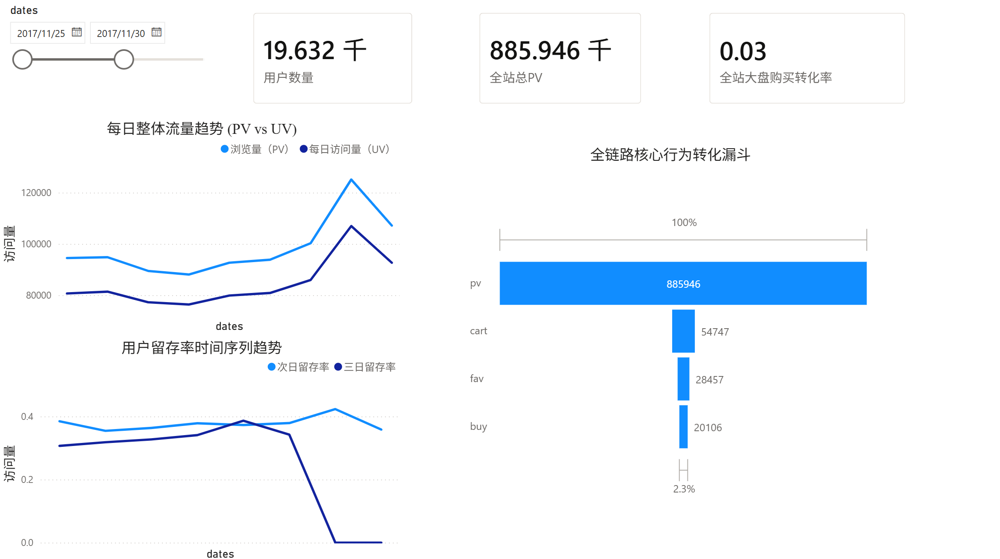
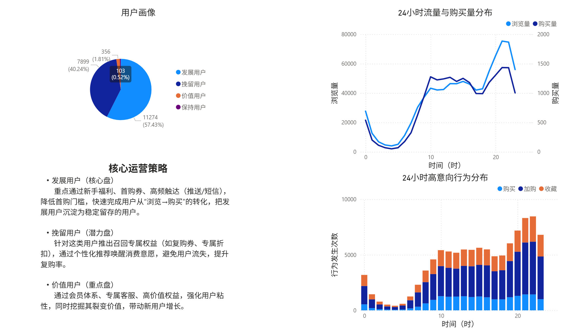
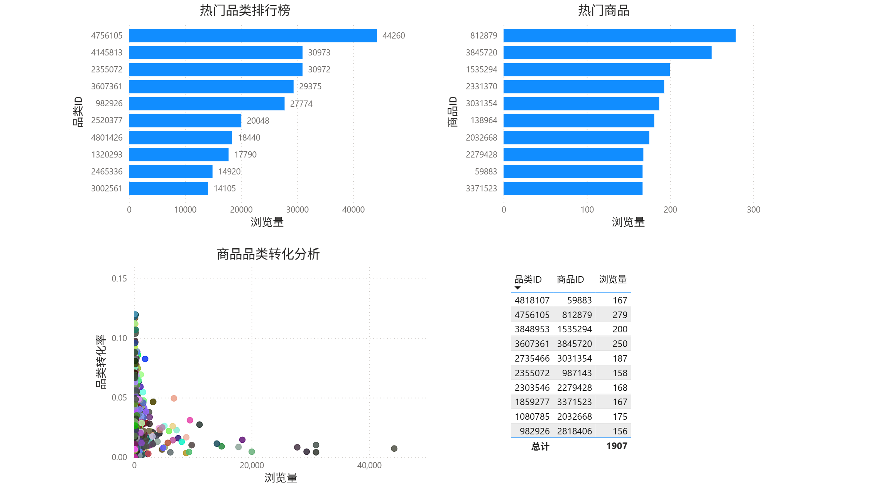

# 淘宝千万级电商用户行为与全链路转化分析 (E-commerce Data Analysis)

## 项目背景
本项目基于阿里巴巴天池开源的真实电商用户行为日志（User Behavior Data）。通过构建完整的 ELT 数据清洗流水线，结合 MySQL 数据建模与 Power BI 可视化，对千万级大盘流量、核心转化漏斗、RFM 用户价值及品类效能进行深度挖掘。
此外，项目引入了大模型 API (LLM) 进行 AI 运营分析，实现了从“异常数据监测”到“业务策略生成”的自动化闭环。

## 技术栈
* **数据预处理**：Python (Pandas)
* **数据建模与分析**：MySQL 8.0 (CTE、窗口函数、聚合查询)
* **商业智能可视化**：Power BI
* **AI 运营诊断**：DeepSeek API, Prompt Engineering
* **工程规范**：Git, Python-dotenv (环境变量脱敏)

## 项目结构
```text
电商用户行为分析/
├── data/                      # 存放原始数据集及清洗后的 CSV 文件 (受限于体积未上传)
├── src/                       # 核心源代码目录
│   ├── clean_data_loading.py  # 数据清洗与入库脚本
│   └── ai_ops_demo.py         # 基于 LLM 的异常转化归因分析脚本
├── .env.example               # 环境变量配置模板
├── .gitignore                 # Git 忽略配置
├── README.md                  # 项目说明文档
└── requirements.txt           # Python 依赖清单
```

## 核心业务模块与分析结论

### 1. 流量大盘与时间序列洞察
* 计算每日 PV、UV 及留存率变化趋势。
* **业务洞察**：24小时活跃度呈标准双峰分布。每日 20:00-22:00 为全站黄金交易高峰期，凌晨 3:00-5:00 为绝对低谷。时序特征高度规律，可指导定向广告投放与服务器资源弹性扩容。

### 2. 全链路转化漏斗分析
* 构建 `浏览(PV) -> 收藏/加购(Fav/Cart) -> 购买(Buy)` 倒三角转化模型。
* **业务洞察**：大盘全局购买转化率为 **2.27%**。流失极值发生在“浏览至加购/收藏”环节（转化率仅 9.39%），后续运营需重点切入“购物车催付”及“限时满减”策略。

### 3. RFM 用户价值矩阵重构
* 跨越静态阈值，针对数据集的抽样特征（1% 行级抽样）重新校准 F（购买频次）的得分区间。
* **业务洞察**：锁定平台核心高净值人群。其中“价值用户”仅占总购买人数的 **1.8%**，却构成了复购的主力；“发展用户”占比高达 57%，是近期新客促活的核心目标。

### 4. 商品效能与爆款挖掘 (大数法则应用)
* 输出热门品类与高频商品 Top 10 排行榜。
* **业务洞察**：在计算特定商品/品类转化率时，引入 `HAVING pv > 20` 阈值过滤，剔除长尾低频数据的统计学噪音（100% 虚假转化率），精准定位兼具高曝光与高转化的“利润引擎”。

### 商业智能仪表盘展示




## 核心工程突破 (Highlights)

1. **破除“时区陷阱”**：在 ETL 阶段，敏锐识别原始 Unix 时间戳的 UTC 时区偏移导致的流量波峰异常（下午 13 点）。通过 SQL `DATE_ADD()` 函数精准还原东八区真实业务时间。
2. **抗击“抽样塌缩”偏差**：深刻理解 1% 随机盲抽对连续性指标（如留存链路）的破坏，在进行漏斗统计与 RFM 分层时动态修正业务阈值，确保量化指标具备全局代表性。
3. **AI 辅助运营诊断闭环**：通过 SQL 提取“高流量、极低转化”的异常品类，利用 Python 调用 DeepSeek API 并注入结构化 Prompt，强制约束 JSON 输出格式，实现长尾异常品类的自动化根因诊断与运营策略推荐。

## 快速启动 (Quick Start)

1. **克隆项目**
    git clone https://github.com/Domuna/ecommerce-behavior-analysis.git
    cd ecommerce-behavior-analysis

2. **安装依赖**
    pip install -r requirements.txt

3. **配置环境变量**
    将 .env.example 重命名为 .env，并填入大模型 API 密钥：
    DEEPSEEK_API_KEY=your_actual_api_key_here

4. **运行 AI 诊断演示**
    python src/ai_ops_demo.py